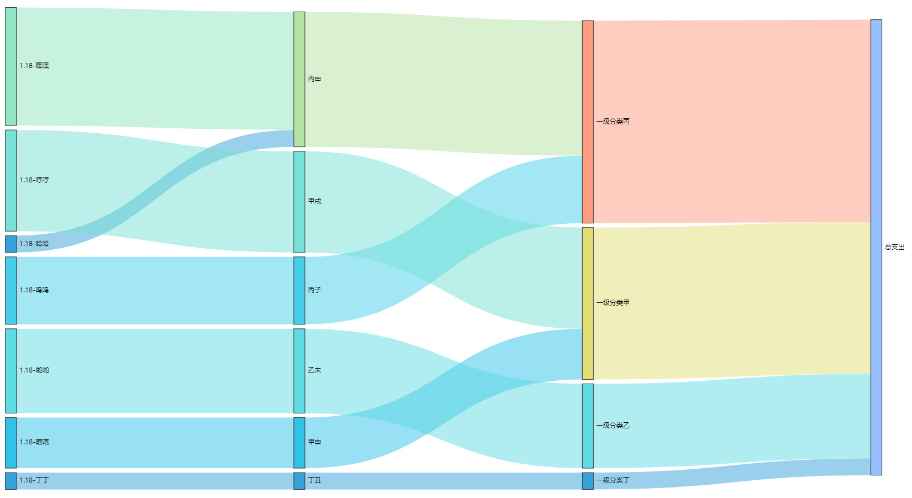

# Account Book  
​	A simple account book, GUI is based on PyQt5. The Sankey-diagram-style visualization is powered by pyecharts. Chinese version only now.

​	一个简单的小账本，采用桑基图对账目进行可视化，图形界面基于PyQt5实现。

​	

### Background

​	Find myself bored during this vacation, then this tiny project born.

### Prerequisites

​	Download this project, then

```
pip install -r requirements.txt
```

### Usage

- The entrance of the project is main.py .

- Accounts would be written into 'spending.csv', classifier would be written into 'classifier.csv', both csv files should be initialize when you launch the main.py for the first time, they are in the same directory of main.py.

- You can check the Sankey diagram in the 'result.html', HTML file would be generated after your click on the  generate button or you can get it with command``` python diagram.py ```.

  

​	

​	P.S. I've try packing by Pyinstaller, but all efforts were in vain as u see ;)

### Maintainers
- [@rtli](https://github.com/rtli)

### License

​	This project is licensed under the MIT License.