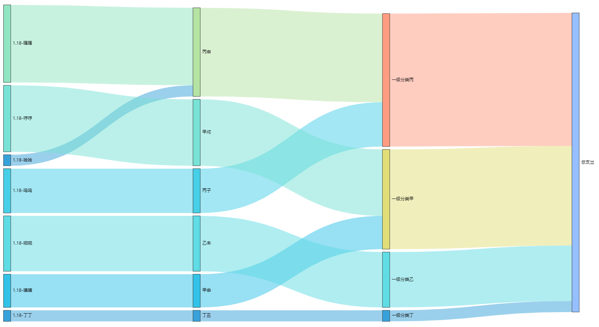

# Account Book


一个现代化的个人记账工具，采用前后端分离架构，支持桑基图可视化资金流向。



## 技术栈

| 层级 | 技术 |
|------|------|
| 前端 | React + TypeScript + Vite + Ant Design |
| 后端 | Python FastAPI + SQLAlchemy |
| 数据库 | SQLite |
| 可视化 | ECharts (桑基图 / 柱状图 / 饼图) |

## 功能

- **快速记账** — 表单录入，实时反馈
- **账目管理** — 列表展示，支持搜索、日期筛选、分类筛选、编辑、删除
- **分类管理** — 树形结构，支持两级分类的增删
- **统计分析** — 桑基图资金流向 + 月度趋势 + 分类占比饼图
- **数据导入/导出** — CSV 格式，方便备份与迁移

## 快速开始

详细的环境搭建、依赖安装与启动步骤请参阅 **[install.md](install.md)**。

> 本项目假设 Python 环境由 [uv](https://docs.astral.sh/uv/) 管理。

### 极简启动

```bash
# 1. 后端
uv venv --python 3.10
.venv\Scripts\activate        # Windows
uv pip install -r backend/requirements.txt
uv run uvicorn backend.main:app --reload --port 8000

# 2. 前端
cd frontend && npm install && npm run dev
```

打开浏览器访问 http://localhost:5173 即可使用。

## 项目结构

```
Account-Book/
├── backend/                 # FastAPI 后端
│   ├── main.py             # 应用入口
│   ├── constants.py        # 全局常量
│   ├── database.py         # 数据库连接
│   ├── models.py           # 数据模型
│   ├── schemas.py          # 请求/响应模型
│   ├── migrate.py          # 旧数据迁移脚本
│   ├── requirements.txt    # Python 生产依赖
│   ├── requirements-dev.txt # Python 开发依赖
│   └── routers/
│       ├── spending.py     # 账目 API
│       ├── category.py     # 分类 API
│       ├── statistics.py   # 统计 API
│       └── data.py         # 导入导出 API
├── frontend/                # React 前端
│   ├── src/
│   │   ├── App.tsx         # 主布局与路由
│   │   ├── pages/          # 页面组件
│   │   └── services/       # API 调用层
│   ├── package.json
│   └── vite.config.ts
├── data/                    # SQLite 数据库 (自动创建)
├── install.md               # 构建与安装指南
├── start-dev.bat            # 一键启动脚本
└── README.md
```

## API 文档

后端启动后，访问 http://127.0.0.1:8000/docs 查看自动生成的 Swagger API 文档。

## License

MIT
